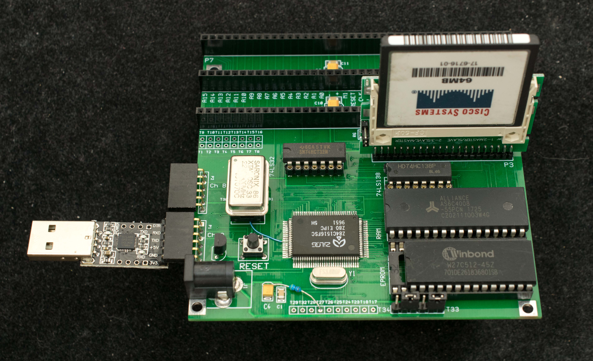
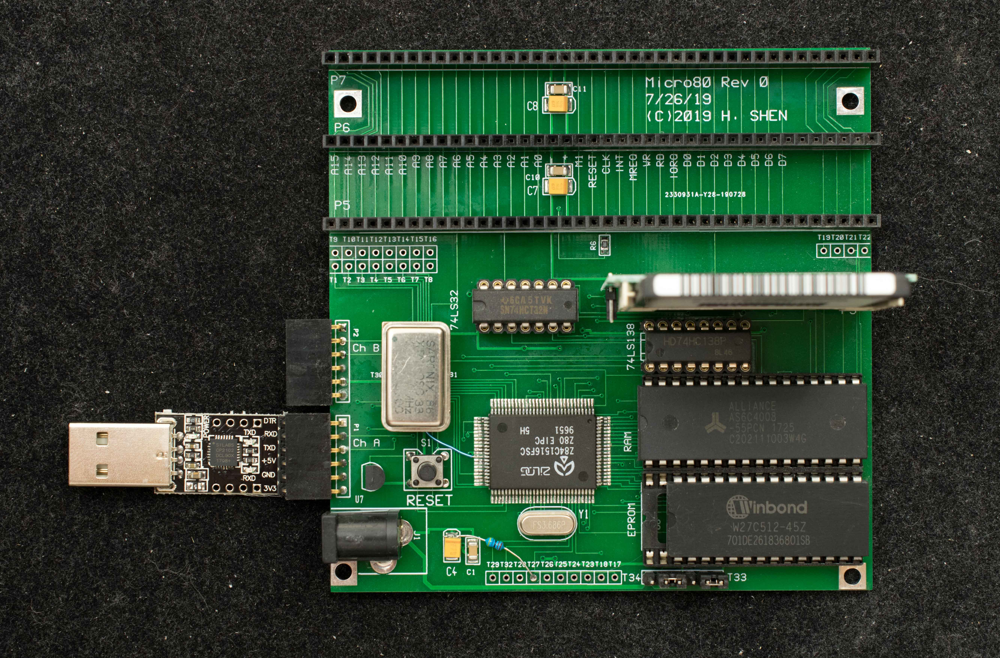
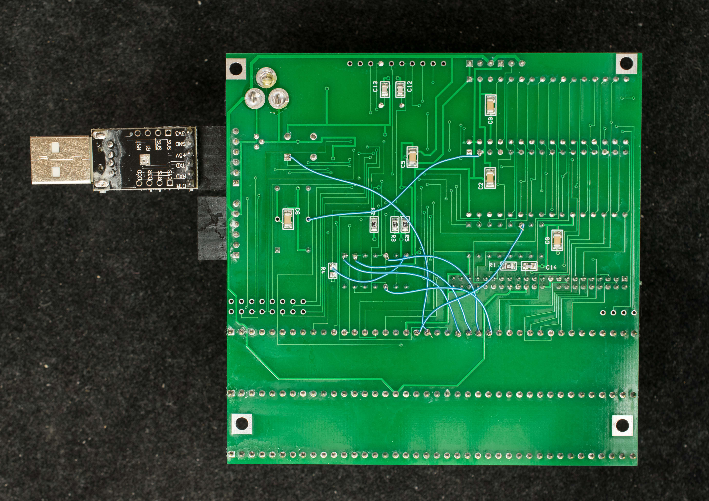

# Micro80, Z80 SBC with Z84C1516 (Rev0 prototype)
### Introduction
Micro80 is a classical microprocessor design using the Z84C1516 Intelligent Peripheral Controller

### Features
- Z84C1516 Intelligent Peripheral Controller
  - Z80@16MHz
  - Two channel SIO
  - Four counter/timer
  - Clock generator
  - PIO
- 128K RAM in 2 banks
- Up to 512K EPROM in 8 64K banks
- Three RC2014 expansion bus
- Compact Flash mass storage
- CP/M ready

### Design Information
- [Schematic](micro80_rev0_scm.pdf)
- [Gerber photoplots](micro80_r0_gerber.zip)
- Engineering changes
